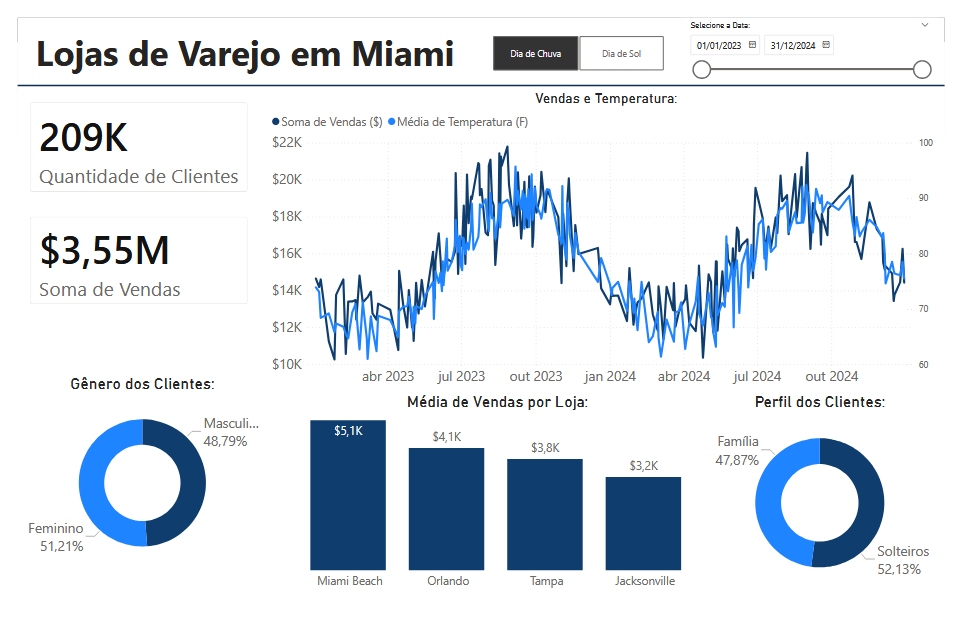

# Análise de Lojas de Varejo na Flórida  
### Clima, Vendas e Estudo de Clientes 

Projeto de análise de dados desenvolvido com foco em entender como **clima, localização e perfil de clientes impactam as vendas diárias** em quatro lojas de varejo na Flórida:

- Miami
- Orlando
- Tampa
- Jacksonville

---

---

## Objetivos do Projeto:

Fornecer insights estratégicos para melhorar:

- Planejamento operacional
- Escala de funcionários
- Gestão de estoque
- Estratégias promocionais
- Expansão de lojas

---

### Problemas de Negócio:

As vendas sofrem forte influência de:

- Temperatura
- Chuva
- Sazonalidade
- Perfil demográfico dos clientes

No entanto, a gestão não possuía clareza sobre:

- A força da correlação entre clima e vendas
- Diferenças de performance entre lojas
- Padrões de consumo entre famílias e solteiros
- Impacto de gênero no comportamento de compra
- Efeitos de fim de semana e sazonalidade

---

## Etapas do Projeto:

### 1 Coleta e Tratamento de Dados

Integração de três fontes principais:

-  Vendas diárias
-  Dados climáticos (temperatura e chuva)
-  Pesquisas demográficas de clientes

---

### 2 Dashboard no Power BI

Criação de painel interativo para stakeholders com:

###  KPIs Principais
- Quantidade de Clientes: **209K**
- Soma de Vendas: **$3,55M**

###  Vendas vs Temperatura
Análise temporal relacionando:
- Soma de vendas ($)
- Média de temperatura (°F)

###  Média de Vendas por Loja
Comparação entre:
- Miami Beach
- Orlando
- Tampa
- Jacksonville

###  Perfil Demográfico
- Famílias vs Solteiros
- Masculino vs Feminino

###  Filtros Interativos
- Período
- Condição climática (Dia de Sol / Dia de Chuva)

---

## Objetivos:

- Relacionar vendas com padrões climáticos
- Identificar correlação entre temperatura e receita
- Avaliar impacto da chuva
- Detectar padrões sazonais
- Comparar desempenho entre lojas
- Analisar comportamento por perfil demográfico
- Criar base para futuras análises preditivas

---

## Principais Insights:

- 📈 Temperaturas mais altas estão associadas a aumento nas vendas
- 🌧️ Dias chuvosos reduzem fluxo — mas podem ser mitigados com promoções
- 🏖️ Miami apresenta pico em meses turísticos
- 👨‍👩‍👧‍👦 Famílias compram mais aos finais de semana
- 👤 Solteiros apresentam maior atividade durante a semana
- 🏬 Jacksonville apresenta oportunidade de crescimento via fidelização

---

## Recomendações Estratégicas:

- Reforçar equipe e estoque em dias quentes de verão
- Criar campanhas promocionais para dias de chuva
- Expandir operações em Miami durante alta temporada
- Desenvolver programas de fidelidade em Jacksonville
- Direcionar campanhas para famílias aos finais de semana
- Focar em público solteiro durante a semana

---

## Ferramentas Utilizadas:

- SQL
- Power BI
- Modelagem Relacional
---

## Conclusão:

As vendas são moldadas por **clima, localização e perfil de cliente**.

Para maximizar crescimento, gestores devem adaptar operações conforme:

- Mudanças sazonais
- Condições climáticas
- Perfil demográfico predominante

O projeto fornece uma base sólida para:
- Tomada de decisão orientada por dados
- Planejamento estratégico
- Evolução para modelos preditivos

---

## Aprendizado:

Este projeto foi desenvolvido acompanhando a aula disponível neste vídeo: 
https://youtu.be/Hh5-Y_6v5iU?si=eh6AwEdUlCiOm4ZM.
Ao longo do projeto, aprofundei meus conhecimentos em conceitos e técnicas importantes 
Recomendo fortemente para quem deseja evoluir seus estudos em Data Analytics e Business Intelligence.

